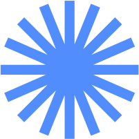
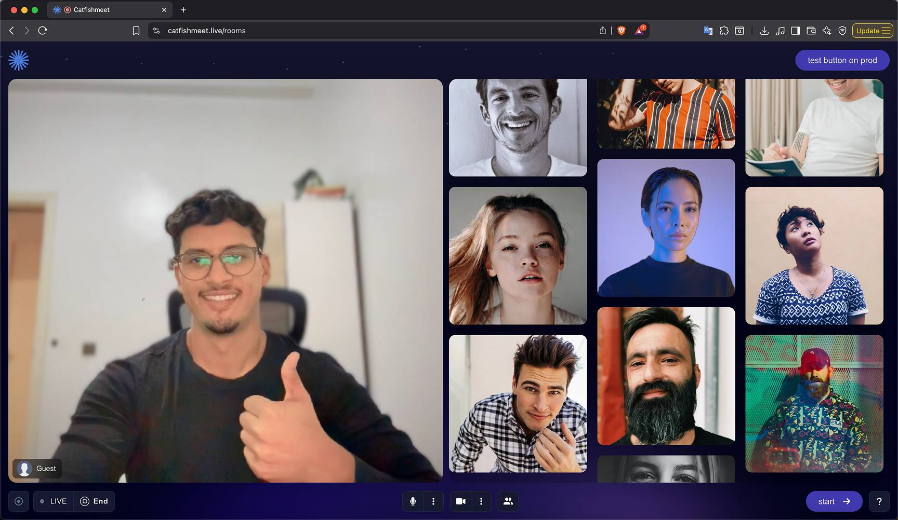

<div align="center">

  

  <h2>CatfishMeet • Real‑time Social Video Rooms</h2>

  <!-- Badges -->
  <p>
    <a href="https://nextjs.org"></a>
    
    
    
    
    
    
  </p>

  <p>
    <a href="#-features">Features</a> •
    <a href="#-architecture">Architecture</a> •
    <a href="#-environment">Environment</a> •
    <a href="#-getting-started">Getting Started</a> •
    <a href="#-api">API</a> •
    <a href="#-sockets">Sockets</a> •
    <a href="#-contributing">Contributing</a>
  </p>

</div>

---

<div align="center">
  
</div>

### ✨ Overview

CatfishMeet is a Next.js web client for discovering and connecting with people in real‑time video rooms. It combines Socket.IO for realtime signaling, PeerJS/WebRTC for low‑latency media, and a clean component architecture for multiple room layouts (2‑user, 3‑user, shuffle, etc.).

> Production demo URL used by the client: `https://demo.catfishmeet.live`

### 🔥 Features

- **Real‑time rooms**: Matchmaking via Socket.IO with JOIN/LEAVE flow
- **WebRTC calls**: Peer‑to‑peer media with PeerJS
- **Multiple layouts**: Two, three, and more‑than‑three user frames
- **Media controls**: Toggle camera and mic, reflect remote state
- **Responsive UI**: TailwindCSS + Next.js App Router
- **Typed networking**: Axios instance, interceptor, and helpers

### 🧭 Project Structure (excerpt)

```text
src/
  app/
    rooms/                 # Rooms page and layout
  features/
    rooms/
      components/          # Call frames, header, controls
      constants/events.ts  # Socket event names (client/server)
      hooks/               # useHome, useInit (media + signaling)
    chat/
      constants/events.ts  # Chat socket events
  networking/
    config.ts              # Axios instance
    requestInterceptor.ts  # Axios request interceptor
    socketUtils.ts         # Socket.IO client wrapper
```

## 🏗 Architecture

The client maintains a Socket.IO connection for room coordination and uses PeerJS for WebRTC media between matched peers. Media state (camera/mic) is synchronized through socket events.

```mermaid
flowchart LR
  subgraph Client[CatfishMeet Web]
    UI[Next.js UI]
    Hook[useHome/useInit]
    Socket[socketUtils (Socket.IO)]
    Peer[PeerJS]
  end

  UI <--> Hook
  Hook <--> Socket
  Hook <--> Peer

  Socket <-- Signaling & Events --> SIO[Socket.IO Server]
  Peer <-- WebRTC Streams --> Peer
```

## 🔧 Environment

The client reads environment variables via Next.js config.

- `BASE_URL`: REST base URL (e.g. `https://demo.catfishmeet.live/api/v1` in prod)
- `SOCKET_URL`: Socket.IO endpoint (e.g. `https://demo.catfishmeet.live` in prod)

See `next.config.ts` for defaults depending on `NODE_ENV`.

## 🚀 Getting Started

```bash
# Install
npm install

# Development
npm run dev

# Production build
npm run build && npm start
```

Open `http://localhost:3000` in your browser.

## 📡 API

REST interactions use a shared Axios instance and a small wrapper for convenience.

- `src/networking/config.ts`
  - `axiosInstance`: preconfigured with `baseURL = process.env.BASE_URL`
  - `requestInterceptor`: placeholder to apply headers, auth, tracing, etc.

- `src/networking/networkUtils.ts`
  - `NetworkUtils.get(url, params?)`
  - `NetworkUtils.post(url, data?, headers?)`
  - `NetworkUtils.put(url, data?)`
  - `NetworkUtils.patch(url, data, headers?)`
  - `NetworkUtils.delete(url, data?)`
  - `NetworkUtils.addHeader(header, value)`

Example usage:

```ts
import NetworkUtils from "@/networking/networkUtils";

async function fetchSomething() {
  const res = await NetworkUtils.get("/example", { page: 1 });
  return res.data;
}
```

## 🔌 Sockets

The client wraps Socket.IO in `src/networking/socketUtils.ts` and exposes utility methods: `emit`, `on`, `once`, `off`, `disconnect`, `getSocket()`.

### Rooms Events

Defined in `src/features/rooms/constants/events.ts`.

```ts
// Client -> Server
RoomEvents.client = {
  JOIN_ROOM: 'join-room',
  LEAVE_ROOM: 'leave-room',
  TOGGLE_CAMERA: 'toggle-camera',
  TOGGLE_MIC: 'toggle-mic',
  STREAM_STARTED: 'stream-started',
}

// Server -> Client
RoomEvents.server = {
  USER_JOINED: 'user-joined',
  USER_DISCONNECTED: 'user-disconnected',
  CAMERA_TOGGLED: 'camera-toggled',
  MIC_TOGGLED: 'mic-toggled',
  READY_TO_JOIN: 'ready-to-join',
  STREAM_STARTED: 'stream-started',
}
```

Typical flow (`src/features/rooms/hooks/useHome.ts` & `useInit.ts`):

1. User clicks “Join/Next” → `JOIN_ROOM` emitted with `userId`
2. Server matches peers → emits `USER_JOINED` to other user
3. PeerJS connects and calls; upon receiving stream, the callee answers
4. Once remote stream is received, UI updates and media toggles are synced
5. Leaving/skipping emits `LEAVE_ROOM`; server responds with `READY_TO_JOIN`

### Chat Events

Defined in `src/features/chat/constants/events.ts`.

```ts
ChatEvents.client = { SEND_MESSAGE: 'send-message' }
ChatEvents.server = { RECEIVE_MESSAGE: 'receive-message' }
```

## 🎥 Media & Peer Connections

Media is acquired with `getUserMedia` and previewed locally. PeerJS is used for P2P media exchange. Camera/mic toggles both update local tracks and notify others through sockets.

Key locations:

- `src/features/rooms/hooks/useInit.ts`: Peer setup, answering calls, remote stream handling, reconnection logic
- `src/features/rooms/hooks/useHome.ts`: Join/leave flows, media toggle handlers

## 🧩 UI & Layouts

Room frames and responsive layouts live under `src/features/rooms/components/CallFram/*` with variants for 2, 3, and more users, plus mobile/desktop specific views.

## 🗂 Scripts

```json
{
  "dev": "next dev --turbopack",
  "build": "next build",
  "start": "next start",
  "lint": "next lint"
}
```

## 🖼 Screenshots & Demos

Place marketing screenshots in `docs/screenshots/` and link them below.

<!--
### Homepage


### Room (2 users)


### Room (Shuffle)

-->

## 🤝 Contributing

Contributions are welcome! Please:

- **Fork** the repo and create a feature branch
- Follow the existing **code style** and **TypeScript** patterns
- Keep components **small and focused**; prefer hooks for logic
- Open a **PR** with a clear description and screenshots where relevant

## 📜 License

This project’s license is not yet specified. If you plan to open source, consider MIT/Apache-2.0 and add a `LICENSE` file.

---

Made with ❤️ using Next.js, Socket.IO, and WebRTC.
